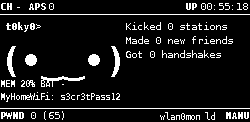

# pwnagotchi-customstats

A small [pwnagotchi](https://github.com/jayofelony/pwnagotchi) UI plugin that adds two things to the screen:

- **A battery column** placed just to the left of the stock `memtemp` readout (so you get `bat | mem | cpu | temp` in a row).
- **The last cracked Wi-Fi** (SSID + password) below the face.



*(the cracked line above shows a demo entry; it stays blank until something actually cracks)*

## How it works

- **Battery** is resolved in this order: [`pisugar-server`](https://github.com/PiSugar/pisugar-power-manager-rs) on TCP `8423` if it's installed, otherwise a **direct I2C read of the gauge — no server required**: **PiSugar 3** (battery-% register at `0x57`) or **PiSugar 2** (IP5209 gauge voltage at `0x75`, mapped to % via a discharge curve). If nothing answers it shows `-` instead of crashing the UI.
  - *PiSugar 2 note:* the IP5209 only powers up (and answers on I2C) while the board is **charging or running the Pi from the battery**. If the Pi is fed only through its own USB **data** port, the gauge sleeps and you'll see `-`. Charge through the PiSugar's own micro-USB port (or run on battery) to get a reading.
- It does **not** show memory/CPU/temp itself — that's the stock `memtemp` plugin's job. This plugin just adds a battery column aligned next to it, so leave `memtemp` enabled.
- **Last cracked Wi-Fi** is read from the [`wpa-sec`](https://wpa-sec.stanev.org/) plugin's results file (`/root/handshakes/wpa-sec.cracked.potfile`, format `bssid:station:ssid:password`). The most recent line is shown. The line is blank until that file has an entry, and the text is trimmed (SSID first, password kept) so it stays clear of the memtemp column.

## Install

1. Copy the plugin into your custom-plugins folder (path is whatever `main.custom_plugins` points to in your config — default below):

   ```bash
   scp customstats.py pi@10.0.0.2:/tmp/
   ssh pi@10.0.0.2 'sudo mkdir -p /etc/pwnagotchi/custom-plugins && sudo mv /tmp/customstats.py /etc/pwnagotchi/custom-plugins/'
   ```

2. Enable it in `/etc/pwnagotchi/config.toml`:

   ```toml
   main.plugins.customstats.enabled = true
   ```

3. Restart:

   ```bash
   sudo systemctl restart pwnagotchi
   ```

## Options

All optional. Defaults are tuned for the Waveshare 2.13" V3 (250×122) with `memtemp` in its default position. Override in `config.toml` to reposition for other displays or `memtemp` layouts:

```toml
main.plugins.customstats.potfile     = "/root/handshakes/wpa-sec.cracked.potfile"
main.plugins.customstats.bat_x       = 125   # battery column; sits one column left of memtemp (155, 76)
main.plugins.customstats.bat_y       = 76
main.plugins.customstats.cracked_x   = 0     # cracked Wi-Fi line, below the face
main.plugins.customstats.cracked_y   = 91
main.plugins.customstats.cracked_max = 24    # max chars before trimming (keeps it left of memtemp)
```

## Note on use

The cracked-Wi-Fi line just displays results produced by the `wpa-sec` plugin. Only capture and crack handshakes for networks you own or are explicitly authorized to test.

## License

GPL-3.0, matching pwnagotchi.
